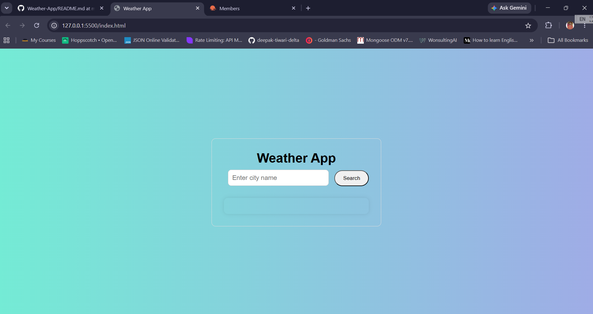

# 🌦️ Weather App

A simple and responsive Weather App built using HTML, CSS, and JavaScript that fetches real-time weather data from the OpenWeather API.

## 🚀 Features

- Search weather by city name
- Real-time weather data
- Temperature display in Celsius
- Feels Like temperature
- Humidity information
- Wind Speed information
- Weather condition description
- Weather icons
- Enter key support for quick search
- Error handling for invalid city names
- Clean and responsive UI

## 🛠️ Technologies Used

- HTML5
- CSS3
- JavaScript (ES6)
- OpenWeather API

## 📸 Screenshot

( )

## 🎯 What I Learned

Through this project, I learned:

- DOM Manipulation
- Event Listeners
- Async/Await
- Fetch API
- Working with JSON data
- API Integration
- Error Handling
- Dynamic UI Updates

## 🔗 Live Demo

(https://deepak-tiwari-delta.github.io/Weather-App/git add .)

## 📂 Installation

1. Clone the repository

```bash
git clone https://github.com/your-username/weather-app.git
```

2. Open the project folder

3. Run `index.html` in your browser

## 📧 Author

Deepak Tiwari

Frontend Developer Learner 🚀